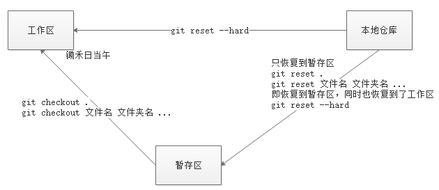

## 版本管理软件的作用

- 版本
  - 历史记录的意思
  - 每次写完代码，都可以“保存”一下。保存之后就会形成一个版本（记录）

版本控制主要解决两个问题：

- 历史记录，能够记录开发过程中的每一个版本，也能够在每个版本之间来回穿梭。
- 多人协作

## 版本管理软件的类别

- 集中式
  - SVN
- 分布式
  - Git

## 使用Git记录版本的步骤

- 初次使用Git

  - 在项目代码文件夹的空白位置，右键--> Git Bash Here
  - 在弹出的窗口中，执行 `git init` ，初始化。（表示当前的项目使用Git管理了）
  - 执行完命令之后，会产生一个隐藏文件 `.git`

- 如何记录写好的代码

  - 在命令行窗口中，执行 `git add .`

  - 在命令行窗口中，执行 `git commit -m '此次记录的说明，类似于注释'`

  - 初次提交代码，会提示

    ```bash
    # --global 会将配置项保存到用户配置
    $ git config --global user.name "xxx"
    $ git config --global user.email "xxx"
    ```

    这里的意思是让我们配置一个账号和邮箱。

    

    > 如果你有GitHub账号， user.name 和 user.email 最好设置成和GitHub一致的名字。

    修改的账号和邮箱在 `C:\Users\你的计算机账号名\.gitconfig` 文件中存放着呢

## 三个区域

- 工作区
  - 代码文件夹就是工作区，新创建的文件肯定在工作区
- 暂存区
  - 执行 `git add .` 之后，新创建的文件会放到暂存区，==此时新创建的文件才算是被Git管理了==
- 本地仓库
  - 执行 `git commit -m '说明'` 之后，才算是形成了一个历史记录或叫做一个版本。

## 添加和提交代码

- 工作区 --> 暂存区
  - `git add .`    `git add 指定的文件`
- 工作区 --> 暂存区和仓库区
  - `git commit -a -m '说明'`  （如果文件曾经被git管理过，才可以使用这个命令）
- 暂存区 --> 仓库区
  - `git commit -m '说明'`

## 恢复代码

- 暂存区 --> 工作区
  - `git checkout .`
- 仓库区 --> 暂存区
  - `git reset .`
- 仓库区 --> 工作区和暂存区
  - `git reset --hard`

## 在历史中穿梭

- 查看每个版本的版本号
  - `git log`
  - `git log --oneline`
- 如何切换（穿梭）到历史的某个版本
  - `git checkout 版本号`
  - `git checkout master` --> 到达最后的版本

## 分支

- 创建分支
  - `git branch 分支名`
- 切换分支
  - `git checkout 分支名`
  - `git checkout -b 分支名` --> 创建并直接切换分支
- 合并分支
  - `git merge 分支名` （注意先切换分支，然后在合并）
- 删除分支
  - `git branch -d 分支名`
- 查看所有的分支
  - `git branch`


## 推送本地仓库的文件到远程仓库

- 首次推送
  - 把本地仓库和远程仓库建立关系。（此时还没有推送）
    - `git remote add 远程仓库地址别名  远程仓库地址`
  - ==首次==推送
    - `git push -u 远程仓库地址别名 本地分支:远程分支`
    - 如果本地分支名和远程分支名一样，则可以省略 `:远程分支`
  - 后续的每一次推送
    - `git push`
  - 注意事项
    - ==首次推送==会弹出一个窗口，让我们填写GitHub的账号和密码

## 多人合作

- 仓库拥有者
  - 邀请合作者
  - 再次编写代码，仍然要 ==先拉后推==
- 合作者
  - 克隆远程仓库文件到本地仓库
    - `git clone 远程仓库地址` --> 把远程的文件拷贝到本地
  - 把新写的代码或修改的文件，==先提交到本地仓库==
  - 先拉取代码 
    - `git pull`
  - 推送代码到远程仓库
    - `git push`

## 解决冲突

在合并分支 或 拉取代码 的时候，如果出现 `CONFLICT` ，则说明文件有冲突。

解决冲突的办法是，将涉及到的程序员叫到一起，一起来解决冲突。

解决完冲突，然后从新执行 `add` 、 `commit` ,最后在 `push`


## 小结

### 本地仓库代码的添加和提交


### 本地仓库代码的回退



### 分支

- 查看分支
  - `git branch`
- 创建分支
  - `git branch 分支名`
- 创建并直接切换分支
  - `git checout -b 分支名`
- 切换分支
  - `git checkout 分支名`
- 合并分支
  - `git merger 分支名`
- 删除分支
  - `git branch -d 分支名`

### 远程仓库的使用

